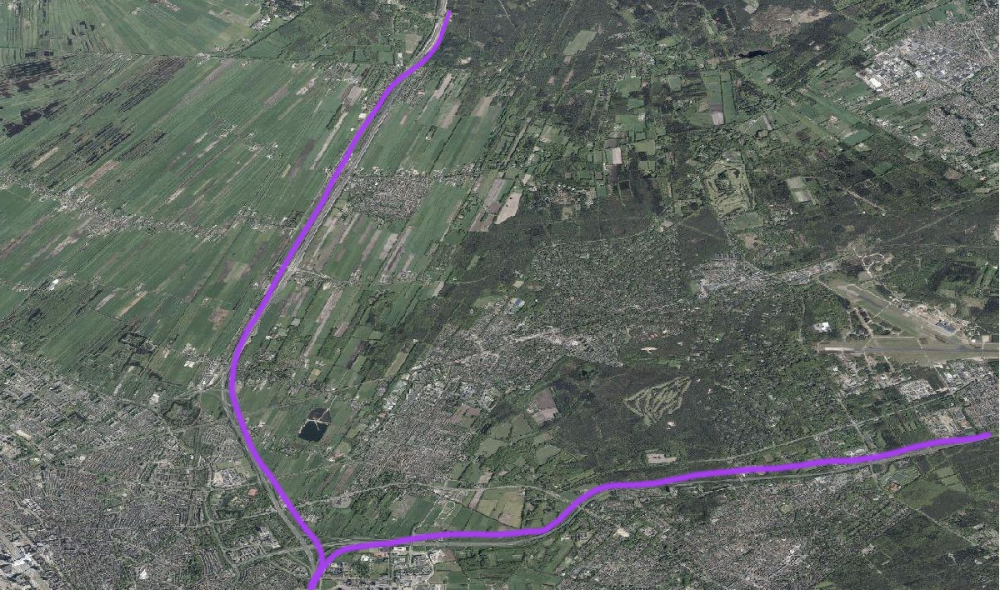
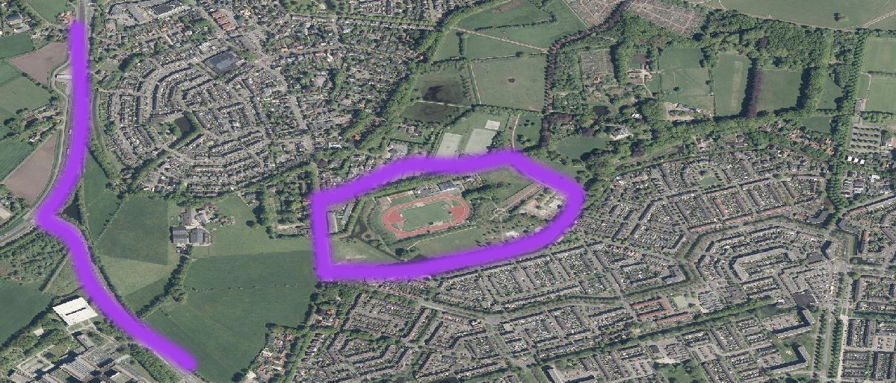
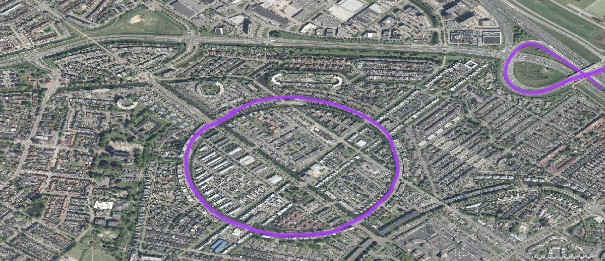
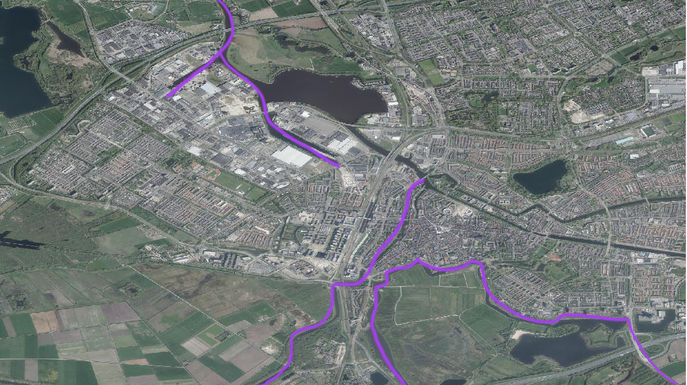
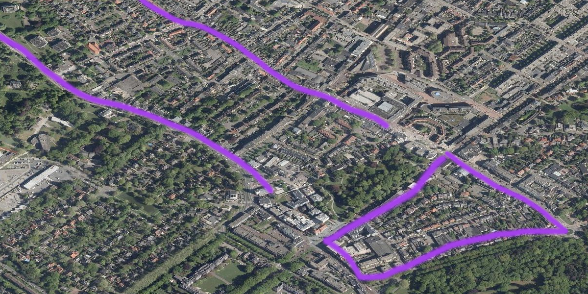
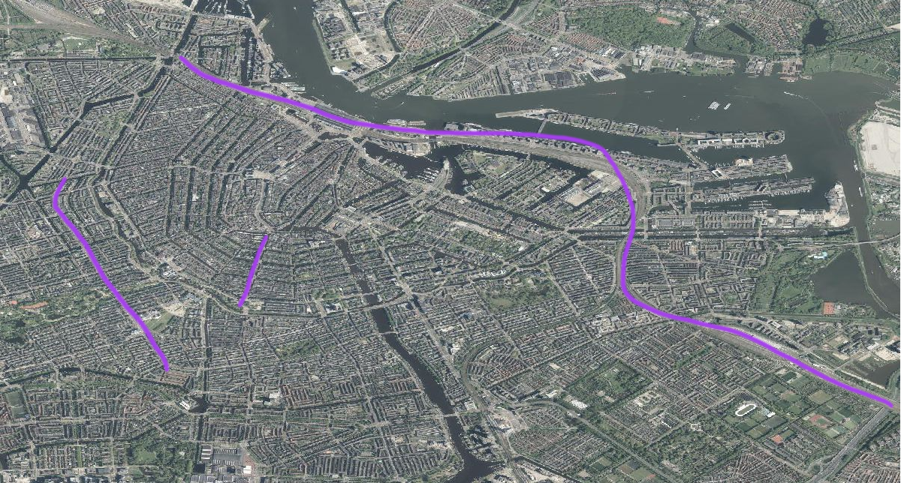

https://geomediadesign.github.io/geobuzz_challenges/

# DIY Geo-Atelier
## Ga deze Geobuzz zelf aan de slag! 

**Verbaas de bezoekers van de Geobuzz met jullie visualisaties en creatieve projectplannen op vijf uitdagingen en wie weet gaat jouw groep die middag met een feestpakket naar huis! Je vindt ons op het onderwijsplein, naast de inspiratieparade. 
Uitreiking van het feestpakket dagelijks om 15.00 uur!

**In het Do it yourself geo-atelier kan je los op het uitwerken en visualiseren van geo-vraagstukken. Wie maakt er binnen één uur de meest aansprekende visualisatie of projectaanpak?

## De challenges
**1. [Waar liggen er atletiekbanen in Nederland?](#1-waar-liggen-er-atletiekbanen-in-nederland)**
**2. [Amersfoort geostad van de toekomst](#2-challenge-amersfoort-geostad-van-de-toekomst)
**3. [Veehouderijen rondom Den Bosch] (#3-challenge-veehouderijen-rondom-den-bosch)
**4. [bijensoort in gemeente Zeist?](#4-challenge-bijensoort-in-gemeente-zeist)
**5. [Tinder voor geodata](#5-challenge-geotinder)

## meenemen
1. computer 
2. pennen, tekenspullen, schaar
3. papier

## what to do?
1. kies een challenge
2. werk deze uit, je kunt een plan van aanpak maken, een kaart een infographic, je kan het met GIS aanpakken of juist meer op een kunstzinnige of journalistieke manier. 
3. plaats je resultaten op padlet

# 1. Challenge: atletiekbanen in Nederland?
### Geef alle atletiekbanen in Nederland weer. 

je kunt denken aan:
kaart van heel Nederland of een specifiek deel ervan, een kaart of een visualistie waarbij de grootte van de baan en de hoeveelheid leden evenredig zijn. 

1. wat gaan jullie maken? plan voor app oid, kaart, infographic, datavisualisatie, anders nl. 
2. Welke datasets of .... heb je hiervoor nodig
3. Met welke programma's ga je aan de slag
4. post het resultaat op: https://padlet.com/B_Rienks/geobuzz2019

### data die je kunt gebruiken

* luchtfoto’s
* <https://www.mulierinstituut.nl/producten-diensten/dataverzameling/>
* <https://opendata.cbs.nl/statline/portal.html?_la=nl&_catalog=CBS>
* <https://www.pdok.nl/downloads/-/article/basisregistratie-topografie-brt-topnl>
* [mulierinstituur atletiekbanen excel](https://github.com/geomediadesign/geobuzz_challenges/blob/master/exportatletiekaeres.xlsx) (volg link en klik op download)
* https://www.nederlandin3d.nl/viewer/#/

# 2. Challenge: Amersfoort geostad van de toekomst
### Passen de speelplaatsen in de wijk bij haar bewoners?

je kunt denken aan: 
koppel de data van Gemeente Amersfoort bijvoorbeeld aan de wijken en buurten van het CBS, en hoe zit het met afvalbakken in de speelplaatsen? 

1. wat gaan jullie maken?
2. Welke datasets of .... heb je hiervoor nodig
3. Met welke programma's ga je aan de slag
4. post het resultaat op: https://padlet.com/B_Rienks/geobuzz2019

### data die je kunt gebruiken
* speelplaatsvoorziening per leeftijd
<https://amersfoort.dataplatform.nl/#/data/96ddc840-a599-4880-82d0-1cb086d458e7?tabName=map_tab&tabId=2&totalViews=8>
* wijken en buurten
<https://www.cbs.nl/nl-nl/maatwerk/2018/30/kerncijfers-wijken-en-buurten-2018>
* afvalbakken <https://amersfoort.dataplatform.nl/#/data/7e824480-f48e-4a9d-b433-5910521bc3a0?totalViews=7>
* https://www.nederlandin3d.nl/viewer/#/

# 3. Challenge: veehouderijen rondom Den Bosch 
## buitengebied, stikstof en de toekomst van de agrarische sector

Vanuit de afdeling Ruimtelijke Ordening en Stedenbouw is de gemeente Den Bosch bezig om de trends en ontwikkelingen in het Bossche buitengebied in kaart te brengen.
Een dominante speler in het buitengebied is de agrarische sector, maar hoe groot is deze sector precies?

je kunt denken aan:
1-  Waar liggen de agrarische bedrijven, wat voor agrarisch bedrijf is het, en hoe groot is het bedrijf gemeten naar aantal stuks vee?
We hebben een Excel lijst met daarin de locaties van de agrarische bedrijven, het type bedrijf en het aantal stuks vee per bedrijf.
2-  Hoe groot is de totale Bossche veestapel (uitgedrukt per soort vee) afgezet tegen de totale Bossche bevolking

1. wat gaan jullie maken?
2. Welke datasets of .... heb je hiervoor nodig
3. Met welke programma's ga je aan de slag
4. post het resultaat op: https://padlet.com/B_Rienks/geobuzz2019

### data die je kunt gebruiken
* excel bestand
* <https://opendata.cbs.nl/statline/portal.html?_la=nl&_catalog=CBS>
* <https://www.pdok.nl/downloads/-/article/basisregistratie-topografie-brt-topnl>
* [agrarische bedrijven rondom Den Bosch excel](https://github.com/geomediadesign/geobuzz_challenges/blob/master/agrarischebedrijvenrondomdb) (volg link en klik op download)
* Let op, het is belangrijk dat het stuks vee in de lijst niet verward wordt met de emissie behorende bij het stuks vee. Dus voor het aantal stuks vee (bijvoorbeeld Melkrundvee) kijken in de kolom ‘melkrundvee’, en niet in de kolom ‘Em. Melkrundvee’ (Em. staat voor emissie).
* https://www.nederlandin3d.nl/viewer/#/

# 4. Challenge bijensoort in gemeente Zeist? 
## bijen willen ook urbaniseren

Bee Foundation heeft een eerste bijenoase aangelegd in gemeente Zeist.Gemeente Zeist is een NL Zoemt Gemeente. Van hieruit willen we verder met de gemeente en verschillende scholen aan de infrastructuur voor wilde bijen werken, zodat er een complete infrastructuur ontstaat voor de belangrijkste soorten in Zeist.

Je kunt denken aan:
•  Welke icoonbij(en) zou je dan kiezen voor Zeist
•  Op welke planten leven zij
•  Op welke grondsoort komen deze planten/bomen voor
•  Waar zijn er in de openbare ruimte plekken waar deze planten/bomen al staan
•  Waar zijn er in de openbare ruimte plekken waar deze planten/aangeplant kunnen worden
•  Gegeven het feit dat ze 200-500 m ver vliegen en dan ze in de grond (zand) nestelen dat in de zon ligt.

1. wat gaan jullie maken?
2. Welke datasets of .... heb je hiervoor nodig
3. Met welke programma's ga je aan de slag
4. post het resultaat op: https://padlet.com/B_Rienks/geobuzz2019

### data die je kunt gebruiken
* <https://www.nederlandzoemt.nl/?gclid=EAIaIQobChMI5rO37ZDn5QIVS-d3Ch1yHAoKEAAYASAAEgJN1PD_BwE>
* zeist data <https://zeist.dataplatform.nl/#/data>
* https://www.nederlandin3d.nl/viewer/#/

# 5. challenge geotinder
## Hoe maak je geodata aantrekkelijker?

werk een plan uit voor een geo-tinder

geo-tinder te maken waarin geodata en services zich op meer en minder geslaagde wijze presenteren. Door te swipen geef je aan welke data (of presentatie van die data) je wel ziet zitten en welke niet. Achterliggende gedachte is de vraag: “Wat verkoopt” als het om geodata gaat? hoe maak je geodata (nog) aantrekkelijker. Je kunt hierbij uiteraard verschillende doelgroepen aanspreken en dus zijn er verschillende oplossingsrichtingen… 

1. wat gaan jullie maken?
2. Welke datasets of .... heb je hiervoor nodig
3. Met welke programma's ga je aan de slag
4. post het resultaat op: https://padlet.com/B_Rienks/geobuzz2019 

 
 
